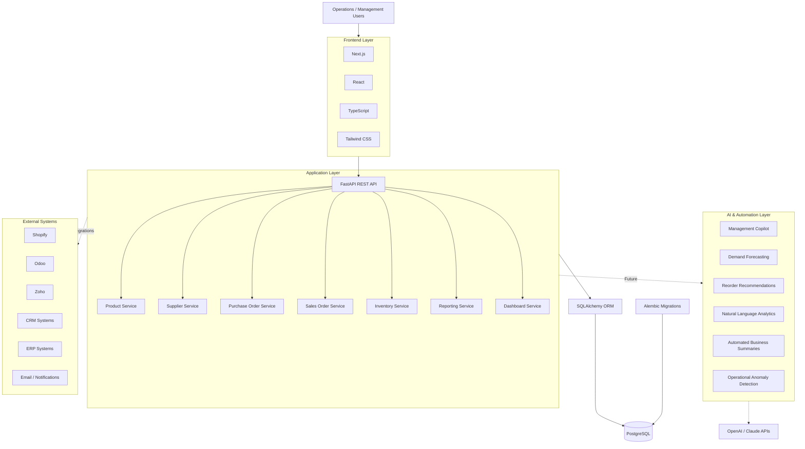

# AI Fashion Operations Platform

A full-stack operations automation prototype built to demonstrate how I would approach an **AI Software Engineer / AI & Operations** role in a fashion and luxury business environment.

This project focuses on one core idea:

> Build reliable operational workflows first, then layer AI and integrations on top of trustworthy business data.

The current prototype connects **suppliers, products, purchasing, inventory, sales, reporting, and management visibility** in one system.

It is designed as a foundation that can later integrate with platforms such as **Shopify, Odoo, Zoho, CRM systems, ERP systems, LLM APIs, and cloud infrastructure**.

---

## Why I Built This

The target role requires more than isolated AI experiments.

It requires understanding how a company actually operates across:

- Sales
- Procurement
- Inventory
- CRM
- E-commerce
- Finance
- Reporting
- Management
- Automation
- AI
- External integrations

So instead of only applying with a resume, I built this prototype to demonstrate how I approach real business problems.

My approach is:

```text
Business Requirement
        ↓
Process Mapping
        ↓
Data Model
        ↓
Backend APIs
        ↓
Workflow Automation
        ↓
Frontend Application
        ↓
Reporting & Management Visibility
        ↓
AI Layer
        ↓
ERP / CRM / E-commerce Integrations
```

---

# Current Business Workflow

```text
Supplier
   ↓
Purchase Order
   ↓
Goods Receipt
   ↓
Inventory Updated
   ↓
Product Availability
   ↓
Sales Order
   ↓
Stock Validation
   ↓
Order Fulfilment
   ↓
Inventory Deduction
   ↓
Revenue & Margin Reporting
   ↓
Management Dashboard
```

This workflow is already functional in the prototype.

---

# Architecture



---

# Technology Stack

## Backend

- Python
- FastAPI
- SQLAlchemy
- PostgreSQL
- Alembic
- Pydantic
- REST APIs

## Frontend

- Next.js
- React
- TypeScript
- Tailwind CSS

## Engineering

- Git
- GitHub
- Environment-based configuration
- Database migrations
- Modular application architecture
- Business workflow automation
- API-first design

---

# Implemented Modules

## Supplier Management

- Supplier directory
- Contact details
- Product associations
- Supplier-linked purchasing

---

## Product Management

- Product catalogue
- SKU management
- Categories
- Cost price
- Selling price
- Reorder level
- Current stock
- Supplier mapping

---

## Purchase Orders

- Create purchase orders
- Multiple purchase-order line items
- Supplier association
- Draft status
- Goods receipt
- Automatic inventory updates

Receiving a purchase order creates inventory transactions and increases stock.

---

## Inventory

Inventory is transaction-driven rather than directly edited.

Supported movements include:

- Purchase
- Sale
- Return
- Damage
- Adjustment

The system also provides:

- Low-stock detection
- Out-of-stock detection
- Inventory value
- Transaction history
- Stock summaries

---

## Sales Orders

- Customer details
- Multiple products per order
- Selling-price handling
- Stock availability checks
- Draft order creation
- Order fulfilment

On fulfilment the application automatically:

```text
Validates Stock
      ↓
Deducts Inventory
      ↓
Creates Inventory Transaction
      ↓
Marks Order Fulfilled
      ↓
Updates Reporting
```

---

# Reporting

Current reporting includes:

- Total revenue
- Fulfilled orders
- Items sold
- Estimated cost
- Estimated gross profit
- Gross margin
- Top-selling products
- Daily sales

---

# Management Dashboard

The dashboard provides operational visibility including:

- Products
- Suppliers
- Total stock units
- Inventory value
- Low-stock products
- Out-of-stock products
- Revenue
- Fulfilled orders
- Gross profit
- Recent inventory transactions
- Recent sales orders

---

# REST API

Current API modules include:

```text
/products
/suppliers
/inventory
/purchase-orders
/sales-orders
/reports
/dashboard
```

FastAPI automatically exposes interactive Swagger documentation at:

```text
/docs
```

---

# Database Management

The project uses PostgreSQL with Alembic migrations.

Current database entities include:

```text
Supplier
Product
InventoryTransaction
PurchaseOrder
PurchaseOrderItem
SalesOrder
SalesOrderItem
```

Database schema changes are version controlled through migrations instead of modifying production databases manually.

---

# AI Roadmap

The operational foundation allows AI to interact with meaningful business data instead of operating independently.

Planned capabilities include:

## AI Management Copilot

Management users could ask:

```text
What were today's sales?

Which products are running low?

Which products generated the highest revenue?

What should we reorder?

Summarize the main operational issues today.
```

The assistant would query internal business services rather than relying on unstructured prompts.

---

## Demand Forecasting

Use historical sales data to predict:

- future demand
- expected stock requirements
- likely stockouts
- seasonal demand changes

---

## Intelligent Reordering

Combine:

```text
Current Stock
+
Sales Velocity
+
Reorder Level
+
Supplier Lead Time
+
Forecast Demand
```

to generate purchasing recommendations.

---

## Slow-Moving Inventory Detection

Identify:

- products with declining demand
- dead inventory
- capital tied up in stock
- candidates for promotions or markdowns

---

## Natural-Language Analytics

Allow management to query operational data conversationally:

```text
Show me the top five products by revenue this month.

Which items had stock problems this week?

Compare this week's sales with last week.
```

---

## Automated Management Reporting

Generate:

- daily operational summary
- weekly sales summary
- inventory alerts
- purchasing recommendations
- management briefing

---

# Integration Roadmap

The architecture is designed to support business-system integrations.

Potential integrations include:

## Shopify

```text
Shopify Orders
      ↓
Platform API
      ↓
Sales Orders
      ↓
Inventory
      ↓
Reporting
```

Possible functionality:

- synchronize products
- import orders
- synchronize stock
- customer data
- fulfilment status

---

## Odoo / ERP

Potential synchronization:

- purchasing
- inventory
- finance
- suppliers
- sales
- product master data

---

## Zoho / CRM

Potential synchronization:

- leads
- customers
- opportunities
- follow-ups
- customer-service workflows

---

# Production Architecture Direction

For a production deployment, this prototype can evolve into:

```text
                   ┌────────────────────┐
                   │ Web / Mobile Apps  │
                   └─────────┬──────────┘
                             │
                      API Gateway
                             │
                ┌────────────▼────────────┐
                │   Application Services  │
                └────────────┬────────────┘
                             │
                   ┌─────────▼─────────┐
                   │    PostgreSQL     │
                   └─────────┬─────────┘
                             │
         ┌───────────────────┼───────────────────┐
         │                   │                   │
         ▼                   ▼                   ▼
 Background Jobs        AI Services       Integration Layer
         │                   │                   │
         ▼                   ▼                   ▼
      Redis            LLM / ML Models    Shopify / ERP / CRM
```

Production hardening would include:

- Authentication
- Role-based access control
- Audit logs
- Automated tests
- Docker
- CI/CD
- Background workers
- Redis
- Monitoring
- Secrets management
- Rate limiting
- Backups
- HTTPS
- Multi-location inventory
- Central logging
- Security controls

---

# Scalability Approach

The current system is intentionally modular.

Instead of placing all business logic directly inside frontend components, workflows are separated into backend services and API routes.

This makes it possible to later scale individual components such as:

```text
Inventory Service
Sales Service
Order Processing
AI Service
Reporting
Background Jobs
Integration Workers
```

without rebuilding the entire application.

---

# Local Setup

## Backend

```bash
cd backend

python -m venv .venv
```

Windows:

```bash
.venv\Scripts\activate
```

Install dependencies:

```bash
pip install -r requirements.txt
```

Create:

```text
.env
```

based on:

```text
.env.example
```

Create the PostgreSQL database and run:

```bash
alembic upgrade head
```

Start:

```bash
uvicorn app.main:app --reload
```

Backend:

```text
http://127.0.0.1:8000
```

Swagger:

```text
http://127.0.0.1:8000/docs
```

---

## Frontend

```bash
cd frontend
npm install
```

Create:

```text
.env.local
```

based on:

```text
.env.example
```

Start:

```bash
npm run dev
```

Frontend:

```text
http://localhost:3000
```

---

# Project Status

This repository represents a **rapid working prototype**.

Its objective is not to claim that this is a finished ERP or e-commerce platform.

Its purpose is to demonstrate the ability to quickly translate a business requirement into:

```text
Process Understanding
        ↓
System Architecture
        ↓
Database Design
        ↓
Backend Development
        ↓
API Development
        ↓
Workflow Automation
        ↓
Frontend Implementation
        ↓
Operational Reporting
        ↓
AI & Integration Roadmap
```

Given additional time, access to business systems, historical data, and stakeholder requirements, this architecture can be expanded into a production-grade AI-enabled operations platform.

---

# Author

**Kumaresh Baskaran**

AI Software Engineer

Areas of focus:

- AI-enabled business applications
- Workflow automation
- Python backend development
- Enterprise integrations
- PostgreSQL
- REST APIs
- Operational analytics
- Applied AI
- Cloud and infrastructure
- Business process digitization